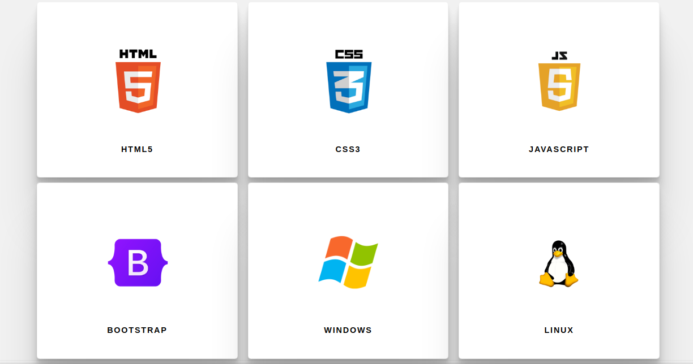

# Como Implementar no seu site

Se você está usando uma página web simples, você precisará copiar o código dos arquivos **cards.html** e **style.css** no local que deseja que apareça as cards. 

Para usar com **Jekyll**, basta copiar os dois arquivos para para a pasta **_includes** e salva-los. Deve-se fazer a chamada do arquivo onde deseja que apareça as cards com as tags **liquid** como no exemplo abaixo. 

**Chamar os arquivos para seu site com liquid**
> 

Seu css, você pode incluir uma nova folha para o site. 
`<link rel="stylesheet" type="text/css" href="style.css">`

*Lembre-se de mudar o nome do arquivo da folha, caso deseje inserir separados da folha principal.* 

Outra maneira é **importar** o código para uma folha existente.
> @import 'style.css';

Faça as melhorias que achar necessário.